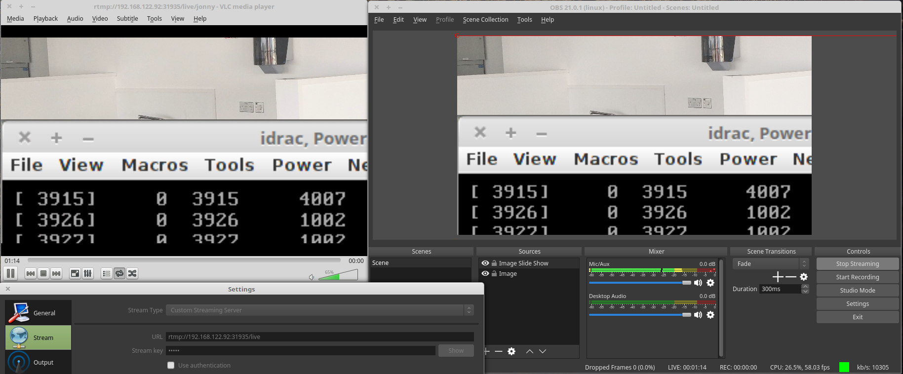

# nginx-rtmp-openshift

OpenShift container image with [**Nginx**](http://nginx.org/en/) and [**nginx-rtmp-module**](https://github.com/arut/nginx-rtmp-module) module for live multimedia (video) streaming.
This code is a fork from [tiagngolo's Docker image](https://github.com/tiangolo/nginx-rtmp-docker) with config changes for OpenShift.

## Description

This [**OpenShift**](https://www.openshift.org/) image can be used to create an RTMP server for multimedia / video streaming using [**Nginx**](http://nginx.org/en/) and [**nginx-rtmp-module**](https://github.com/arut/nginx-rtmp-module), built from the current latest sources (Nginx 1.11.3 and nginx-rtmp-module 1.1.9).

The aim is to allow sending a video stream from [OBS Studio](https://obsproject.com/) to the container and for multiple clients to view the streamed video.

## Details

## How to use

Within an OpenShift (or MiniShift) project choose:
* From the 'Add to Project' menu choose 'Import YAML/JSON'
* 'Browse' for or paste the nginx-rtmp.yaml file from this git repo
* When the container/pod is running open [OBS Studio](https://obsproject.com/)
* Click the "Settings" button
* Go to the "Stream" section
* In "Stream Type" select "Custom Streaming Server"
* In the "URL" enter the RTMP address e.g. `rtmp://<ip_of_host>:<host_port>/live` replacing `<ip_of_host>` with the IP of OpenShift and <host_port> with the nodePort specified in the yaml. For example: `rtmp://192.168.0.30:31935/live`
* In the "Stream key" use a "key" that will be used later in the client URL to display that specific stream. For example: `example1`
* Click the "OK" button
* In the section "Sources" click the "Add" button (`+`) and select a source (for example "Display Capture") and configure it as you need
* Click the "Start Streaming" button
* Open [VLC](http://www.videolan.org/vlc/index.html) or similar video player (it also works in Raspberry Pi using `omxplayer`)
* Click in the "Media" menu
* Click in "Open Network Stream"
* Enter the URL from above as `rtmp://<ip_of_host>:<host_port>/live/<key>` replacing `<ip_of_host>` with the IP of the host in which the container is running, <host_port> with the nodePort specified in the yaml  and `<key>` with the key you created in OBS Studio. For example: `rtmp://193.168.0.30:31935/live/example1`
* Click "Play"
* Now VLC should start playing whatever you are transmitting from OBS Studio

## Debugging

If something is not working try using the 'Terminal' of the relevant OpenShift Pod.  

## Technical details

* This image is built from the same base official images that most of the other official images, as Python, Node, Postgres, Nginx itself, etc. Specifically, [buildpack-deps](https://hub.docker.com/_/buildpack-deps/) which is in turn based on [debian](https://hub.docker.com/_/debian/). So, if you have any other image locally you probably have the base image layers already downloaded.

* It is built from the official sources of **Nginx** and **nginx-rtmp-module** without adding anything else. (Surprisingly, most of the available images that include **nginx-rtmp-module** are made from different sources, old versions or add several other components).

* It has a simple default configuration that should allow you to send one or more streams to it and have several clients receiving multiple copies of those streams simultaneously. (It includes `rtmp_auto_push` and an automatic number of worker processes).

## License

This project is licensed under the terms of the MIT License.
